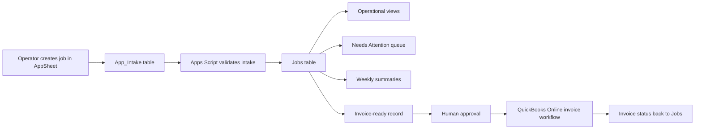

# Architecture

## Overview

The system uses a layered architecture:

- AppSheet: mobile and desktop operator interface.
- Google Sheets: structured source of truth and reporting surface.
- Google Apps Script: automation, validation, protection, refresh, and integration layer.
- QuickBooks Online: accounting system of record for invoice creation and invoice status.
- Future agents: bounded assistants that observe structured data, propose actions, and execute only through approved tools.

## Source-Of-Truth Boundaries

| Layer | Role | Write Access |
| --- | --- | --- |
| AppSheet intake | Operator-facing job creation | Users can add records |
| Jobs table | Operational source of truth | Controlled updates only |
| Summary tabs | Weekly review and payout views | Generated/refreshed by automation |
| Apps Script properties | Integration config and OAuth state | Admin/system only |
| QuickBooks Online | Accounting source of truth | Approved integration action only |

## Data Flow

## Important Design Choices

### AppSheet As Front Door

AppSheet should expose the operator workflow without exposing the machine room. Users should see job creation, active jobs, needs-attention queues, weekly summaries, and payout review.

### Sheets As Operating Layer

Google Sheets remains useful because the business already understands it, formulas can support existing reporting, and Apps Script can enforce structure around fragile areas.

### Apps Script As Control Plane

Apps Script is used for:

- Validating intake rows.
- Promoting valid intake into the Jobs table.
- Refreshing summary tabs.
- Protecting formula/helper columns.
- Creating backups.
- Managing OAuth and API calls for QuickBooks Online.

### Human-In-The-Loop Accounting

Invoice creation is treated as a high-trust workflow. The system can prepare, validate, and propose invoice actions, but human approval remains the control point.

## Agent-Ready Interfaces

The agent layer should consume structured views, not raw spreadsheet chaos:

- New intake queue.
- Needs-attention queue.
- Open jobs.
- Completed but not invoiced jobs.
- Invoice-ready jobs.
- Weekly summary.
- Payout summary.

## Failure Modes Designed Against

- Accidental edits to formulas or helper columns.
- Duplicate job creation.
- Missing painter/status/job notes.
- Invoice notes assembled from incomplete context.
- OAuth token expiry breaking accounting workflows silently.
- AI-generated actions without approval or auditability.

---

Author: ChatGPT / OpenAI  
Model: GPT-5 Codex  
Created: May 29, 2026, 8:38 PM EDT  
Lineage: original
