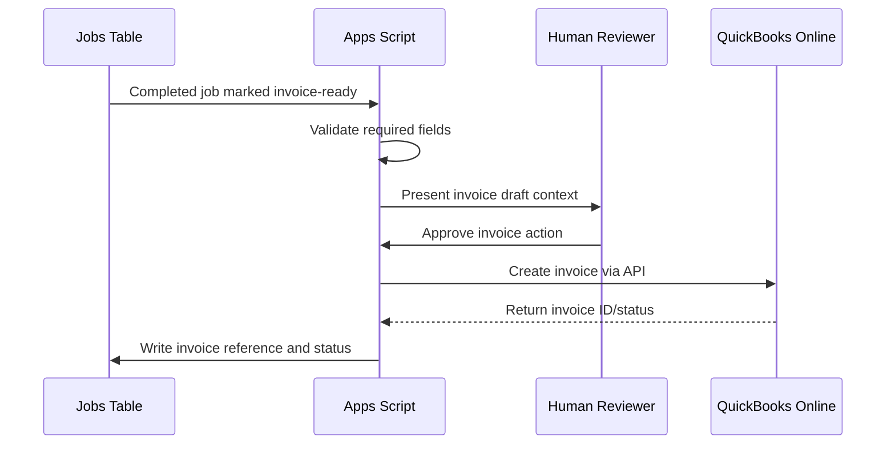

# QuickBooks Online Integration

## Purpose

The QuickBooks Online integration pattern connects structured job records to invoice preparation while preserving human approval and accounting-system boundaries.

This repository does not include live OAuth credentials, realm IDs, tokens, customer records, or production API configuration.

## Integration Flow

## Invoice-Ready Inputs

Typical invoice preparation fields:

- Customer or property reference.
- Unit or work location.
- Job date.
- Service description.
- PO number when required.
- Structured invoice notes.
- Internal notes excluded from customer-facing invoice text.
- Painter or crew assignment when relevant.
- Status and completion marker.

## Notes Aggregation Pattern

One useful pattern is to maintain a dedicated invoice-notes field assembled from multiple operational fields. The goal is to separate:

- Internal operational notes.
- Customer-facing invoice notes.
- Quality-control or follow-up notes.
- Accounting-only metadata.

That separation reduces the chance that internal shorthand lands on a customer invoice.

## OAuth And Token Handling

Production systems should store OAuth configuration and tokens in a protected secret store or equivalent platform-specific secure storage.

For Google Apps Script prototypes:

- Store client ID, client secret, realm ID, redirect URI, access token, refresh token, and token expiry in script properties.
- Never commit credentials or tokens.
- Refresh access tokens before expiry.
- Treat refresh-token expiry as an operational alert.
- Keep callback handling narrow and state-validated.

## Idempotency

Invoice workflows need duplicate protection.

Recommended controls:

- Do not create an invoice if a job already has an invoice ID.
- Use a deterministic idempotency key where supported.
- Write integration attempt status back to the job record.
- Log failed attempts with actionable error messages.
- Require human review before retrying ambiguous failures.

## Agentic Extension

An agent should not directly "decide to bill." A safer pattern:

1. Detect completed uninvoiced jobs.
2. Validate required invoice fields.
3. Draft invoice notes.
4. Explain any missing or risky fields.
5. Ask for approval.
6. Execute the approved QuickBooks action through a narrow tool.
7. Write back result and audit details.

---

Author: ChatGPT / OpenAI  
Model: GPT-5 Codex  
Created: May 29, 2026, 8:38 PM EDT  
Lineage: original
